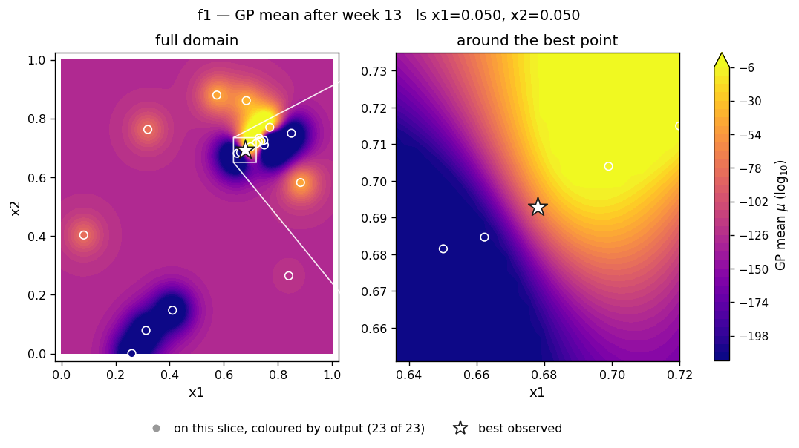
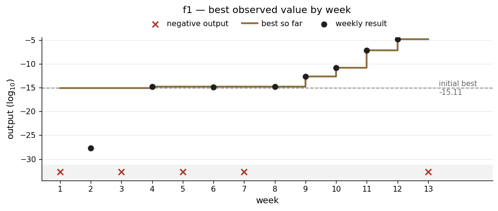

# f1 — a narrow channel across a mostly dead map

**The scenario.** Finding contamination sources — a radiation field, say — across a two-dimensional area, where you only get a non-zero reading if you are close to a source. Both strong and weak sources have to be found.

| | |
|---|---|
| Dimensions | 2 |
| Initial design | 10 points |
| Weekly submissions | 13 |
| Best value | **1.73 × 10⁻⁵** (log₁₀ −4.761) |
| Best on initial design | 7.71 × 10⁻¹⁶ (log₁₀ −15.113) |
| Gain | +10.4 orders of magnitude |
| Weeks returning a negative | 5 of 13 |

## What the function looks like

f1 has only two inputs and was much the hardest of the eight.

Its outputs range across about 140 orders of magnitude in absolute value — about 119 among the positive readings alone — and they change sign. Moving 0.01 in x1 took the result from +1.6 × 10⁻¹⁵ to −4.0 × 10⁻¹⁶ and back again. Fitting a model to just the points near the best one gave a length scale in x1 of about 0.008 — meaning the good region is a channel roughly one per cent of the map wide, with negative readings immediately either side of it.

The scenario explains why. You only get a reading near a source, so almost the whole map is dead and the signal is concentrated in a few narrow spots.

Two things followed from this.

**The raw numbers are unusable as a modelling target.** A handful of enormous values would dominate everything else. So f1 was modelled on log₁₀ of the output. Negative readings were set to a floor of −300 in log space, which keeps the information about *where* the negatives are without letting a big negative number look like a good result when you are maximising.

**Almost every move was a big one.** A step of 0.02 is more than two length scales. From the model's point of view that is a jump into territory it knows nothing about.

## What I did

The decision that defined f1 was made in week 4 and held for the rest of the project: **stop using the model and follow the data directly.**

What triggered it was a prediction that could not possibly be right. With few points and very short length scales, the model extrapolated wildly just outside the sampled cluster, and one run predicted a value of +14.2 in log₁₀ terms. That is a forecast of 10¹⁴ from a function whose best-ever reading was 10⁻¹⁵. The problem was not the balance between exploring and exploiting. The predicted surface itself was nonsense.

From then on I used step vectors. Two nearby points that differed cleanly gave a direction, Δ = (−0.021, −0.011), and each week I applied that same step again. It produced five improvements in a row:

−15.113 → −14.805 → −12.620 → −10.789 → −7.132 → **−4.761** (log₁₀)

Through all of them the model was no help at all. At the week-12 point it gave a predicted value of −118 with an uncertainty of 122. At the week-13 point, −151 with an uncertainty of 118. It had forecast failure for every single one of the gains.

I used a second tactic alongside the stepping. When the sign had recently flipped, I submitted a point *between* two known positives rather than beyond them, on the reasoning that a point sitting between two positive readings is less likely to cross a zero boundary than one past them.

## What went wrong

**Inaccurate initial model parameterisation.** In week 2 I concluded "x2 dominates" based on its length scale of 0.031. By week 12, with a better-fitted model, x1's length scale was 0.0077 and x2's was 0.32. x1 was the sharp one all along.

**Following model recommendations where surface did not warrant it.** In weeks 4 and 5 all four runs pushed x2 upwards, into a gap between my best point and two failed probes. It was a gap, so the model was uncertain there, so the acquisition function wanted it. But I had already recorded two failures in that direction. Overriding this is what produced the first real improvement. Overall looking at other participants results I still did not get close to the true optimum due to following the model initially, but am satisfied that I resolved this in time to make major improvements and achieve a good result. 

## Result

The left panel shows why the campaign looks the way it does. The floored negatives dominate the colour scale, so almost the whole map is one shade and only a few bright spots survive — which is exactly the contamination-source picture the brief describes. The zoom on the right shows the real structure: a bright ridge with a dark trench cutting in immediately below it, and the best reading sitting on the shoulder between the two.

The flat first eight weeks and the steep climb from week 9 are the two halves of the approach. First I found the edges of the channel by crashing into them. Then, once I knew which way it ran, I walked along it.

Week-13 diagnostics — all four runs and the slice grid

| | |
|---|---|
| Acquisition surfaces | [`rbf_ard_ei`](../runs/week_13/surface_f1_rbf_ard_ei_w13.png) · [`matern_ard_ei`](../runs/week_13/surface_f1_matern_ard_ei_w13.png) · [`matern_ard_ucb`](../runs/week_13/surface_f1_matern_ard_ucb_w13.png) · [`rbf_ard_ucb`](../runs/week_13/surface_f1_rbf_ard_ucb_w13.png) |
| Slice grid | [`slice_f1_w13.png`](../runs/week_13/slice_f1_w13.png) |

