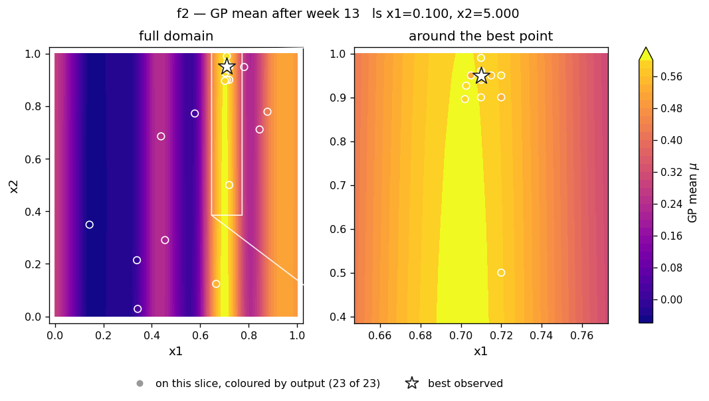
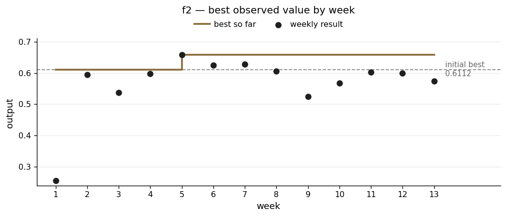

# f2 — a sharp ridge with a flat top

**The scenario.** A black-box ML model that takes two numbers and returns a log-likelihood score. The brief says the output is noisy and that there may be several local peaks. See the note at the end on what that means here.

| | |
|---|---|
| Dimensions | 2 |
| Initial design | 10 points |
| Weekly submissions | 13 |
| Best value | **0.658525** |
| Best on initial design | 0.611205 |
| Gain | +7.7% |

## What the function looks like

f2 has a narrow ridge running up the page at x1 ≈ 0.71. Step 0.07 off it and the output drops from 0.61 to 0.26. Step to x1 = 0.58 and it falls to 0.023.

Along the ridge it is almost flat. Every result on the crest sits between 0.52 and 0.66, and for several weeks it was not clear whether those small differences meant anything at all.

So x1 matters a lot and x2 matters very little. That imbalance is the whole story of f2, and it caused both of the problems below.

## What I did

**Weeks 2–4: find the ridge.** Each submission was picked to differ from an existing point in x1 only, keeping x2 the same, so any change in the output could only be down to x1. That located the crest at x1 ≈ 0.71.

**Weeks 5–11: walk one dimension at a time.** Hold x1 at 0.710 and try x2 at 0.90, 0.95, 0.99, 0.96, 0.94. Then hold x2 at 0.950 and try x1 at 0.72, 0.705, 0.715. Moving one variable per week meant every result could be attributed to something.

**Week 13: use the shape of the bracket.** By then there were points either side of the peak in both dimensions, evenly spaced. The useful signal is which side drops off faster:

| | below the peak | above the peak |
|---|---|---|
| x1 | −0.1346 | −0.0916 |
| x2 | −0.0566 | −0.0299 |

The rule is simple: **step the same distance either way, and the peak is on the side that loses less.** Going towards the peak, part of the step is spent climbing before the output starts falling, so less is lost. Going away from it, the output falls from the outset.

Both dimensions lose more on the way down than on the way up, so the peak sits slightly *above* my best point in both — the opposite of what I had first proposed. Fitting a curve through each set of three points put it at x1 = 0.71047 and x2 = 0.95155, and the model agreed.

## What went wrong

**I decided x2 didn't matter, and I was wrong for four weeks.**

In week 2 I had two points with similar x1 but very different x2, and they gave similar outputs. The model agreed: x2's length scale had gone to the top of its allowed range, which normally means a dimension makes no difference. By week 4 I had written this down as settled.

Week 5 found a clear peak in x2 at 0.950.

The two-point inference was reasonable on what I had. What made the mistake stick was the model appearing to confirm it. In fact a length scale at the top of its range means the data has told the model nothing about that dimension — not that the dimension is unimportant. I made the same mistake on f3, f7 and f8 before I recognised the pattern.

**I couldn't tell whether the small differences were real.**

By week 11 I had four points along the crest at x1 = 0.705, 0.710, 0.715 and 0.720, evenly spaced. The slopes between them were +26.9, then −18.3, then +7.7. A smooth curve cannot change direction like that.

The model was also fitting a noise level of 0.159, bigger than the entire range of the four values (0.057). Read straight, that says the differences I was chasing were indistinguishable from noise, and my best value might just be a lucky reading.

In week 12 I decided this was wrong and refitted the model with the noise forced to near zero, on the grounds that the function ought to be deterministic. That version reproduced every observation exactly and then predicted the next point almost perfectly — 0.602 against an actual 0.6001. I took that as confirmation. The note at the end revisits this.

**I refined the wrong part of the ridge.**

Other participants found the real peak at roughly the same x1, around 0.71, but at a considerably *lower* x2 than the 0.95 I settled on. My campaign spent eight weeks tuning inside the narrow band x2 ∈ [0.90, 0.99] and never seriously tested the rest of the ridge.

Looking back at the data, the whole ridge is only sparsely sampled away from that band. At x1 near 0.71 there is exactly one observation with x2 below 0.5 — (0.666, 0.124), scoring 0.539 — plus week 2's (0.72, 0.50), scoring 0.594. Both are respectable, sitting inside the same 0.52–0.66 range as the high-x2 cluster I was polishing.

Which makes the week-2 mistake worse than it first looked. Those two points are what convinced me x2 did not matter. They were in fact telling me something more useful: the ridge is good in more than one place, and the low-x2 end had been visited twice and never followed up. I read "x2 is irrelevant" from evidence that should have read "there is another region here worth a query."

This is precisely the failure the brief warns about — getting stuck in a local optimum. I bracketed a peak very carefully. It was not the highest one.

**A bad candidate caught by looking at it.**

The first week-12 proposal was (0.627, 0.993), chosen because the model was very uncertain there. Plotting the surface showed it sitting on the falling left side of the ridge, with a predicted value of 0.290 and expected improvement of zero. It had been picked on uncertainty alone without anyone checking what the model actually expected to find there.

## Result

The ridge shows clearly: a bright vertical band at x1 ≈ 0.70 with the surface falling away on both sides. Look along the band and there is a slight brightening towards the top. That faint gradient is the x2 effect I spent four weeks concluding did not exist.

The best value was set in week 5 and never beaten. The eight weeks after it were spent measuring that peak from both sides in both dimensions, which is why those results sit *below* the best — each was a deliberate step onto a flank. At the time this looked like a function that was finished. It was not; it was a peak that had been thoroughly mapped while a better one went untested.

## Note added afterwards: what "noisy" means here

The problem brief describes f2's output as noisy. That sounds like it contradicts the week-12 decision to treat the function as deterministic, but it does not, and the distinction is worth setting out.

**The functions do not return different answers for the same input.** Two points in f5 that swap x2 and x4 both returned 7786.316251, identical to every digit. Two points in f4 that swap x1 and x4 both returned 0.696302. Those came from the same evaluation service in different weeks. If a random draw were added to each call, that could not happen.

**So "noisy" means the surface is rough, not random.** The brief's full sentence is "each output is noisy, and depending on where you start, you might get stuck in a local optimum" — a description of a bumpy landscape with fine structure, not of a randomised measurement. Repeating a query would give the same answer; it just would not be a smooth answer.

Read that way, week 12's diagnosis was right. The model had been describing real fine structure as noise because its length scale was too coarse to represent it. Forcing the noise term to near zero made it fit that structure instead of explaining it away.

Week-13 diagnostics — all four runs and the slice grid

| | |
|---|---|
| Acquisition surfaces | [`rbf_ard_ei`](../runs/week_13/surface_f2_rbf_ard_ei_w13.png) · [`matern_ard_ei`](../runs/week_13/surface_f2_matern_ard_ei_w13.png) · [`matern_ard_ucb`](../runs/week_13/surface_f2_matern_ard_ucb_w13.png) · [`rbf_ard_ucb`](../runs/week_13/surface_f2_rbf_ard_ucb_w13.png) |
| Slice grid | [`slice_f2_w13.png`](../runs/week_13/slice_f2_w13.png) |

