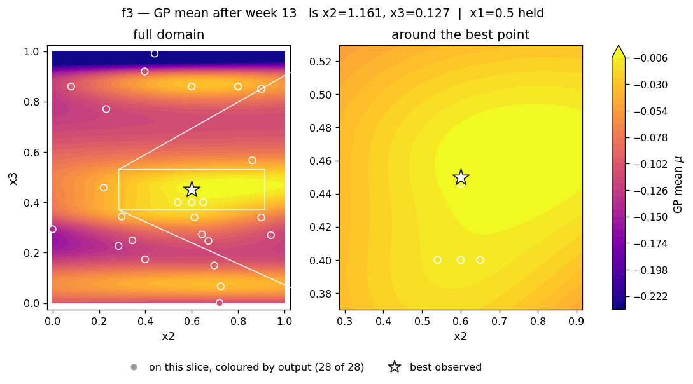
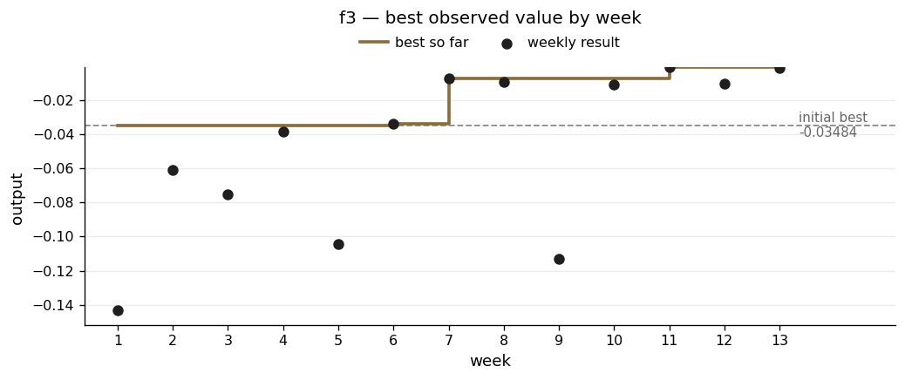

# f3 — the dimension nobody had ever tested

**The scenario.** Drug discovery. Each experiment mixes three compounds, and the output is the number of adverse reactions it causes. The goal is to minimise side effects, set up here as maximising the negative — so zero is the ceiling and you are working upwards towards it.

| | |
|---|---|
| Dimensions | 3 |
| Initial design | 15 points |
| Weekly submissions | 13 |
| Best value | **−0.000604** |
| Best on initial design | −0.034835 |
| Gain | 98% of the way to zero |

## What the function looks like

f3 is smooth and well behaved — no sign changes, no extreme values, one peak in the region I explored.

The three inputs matter very differently. x3 is sharp, with a clear peak at 0.446. x2 matters moderately. x1's length scale sat at the top of its allowed range for eleven of the thirteen weeks, which normally means a dimension makes no difference.

Starting from −0.0348, the campaign closed to −0.000604 — about one six-hundredth of the original shortfall.

## What I did

**Weeks 2–5: buy information.** The early submissions were not attempts to win. Week 2 went deliberately into the unexplored high-x3, high-x2 corner, and the rationale written before the result said what either outcome would establish: a good result reveals a new region, a poor one confirms high x3 is bad whatever x2 does and justifies concentrating on low x3. It came back at −0.061, worse than the incumbent but not disastrous, and it closed the question.

That week's notes also contain the most careful line I wrote in the early weeks: *"the model cannot distinguish x1/x2 relevance from current data."* It was correct, and it took me another nine weeks to act on it.

**Weeks 6–11: bracket one dimension at a time.** From here I fitted the model only to the points near the current best, rather than asking it to describe the whole space at once. x2 went through 0.60, 0.65 and 0.54 and settled at 0.60. x3 went through 0.40 and 0.45; the slope between successive points fell from +0.464 to +0.130, and fitting a curve through them put the peak at 0.446.

**Week 12: test x1 properly.** See below.

## What went wrong

**I called x3 "sharply resolved" when I had only measured one side of it.**

By week 9 my points near the peak sat at x3 = 0.3402 and 0.4000 below the best at 0.4500 — and then nothing at all until 0.8600. That is a gap 0.41 wide. The decline the model showed above 0.45 was not measured; it was the model interpolating across an empty stretch, with its uncertainty climbing steeply through it. My earlier confidence had come from looking at a curve whose right-hand half was made up.

Probing that unmeasured side produced the best value of the whole campaign.

**x1 had never been tested against anything, anywhere.**

This is the finding f3 is worth remembering for. I checked every observation and found that the five points near the good region all sat at x1 = 0.500 exactly. Every other roughly-comparable pair in the dataset differed in x2 or x3 as well — and since x3 has a much shorter length scale, those differences swamped anything x1 was doing. The pairs also contradicted each other in sign.

So the model's verdict that x1 did not matter was not a finding. **It was the absence of one.** With no pair of points differing in x1 alone, there was nothing in the data to pin that length scale down, so it drifted to the edge of its allowed range and stayed there.

In week 12 I spent a submission on x1 = 0.00, holding x2 and x3 at their confirmed values. The model gave it a 48.8% chance of beating the best, which is to say it had no opinion — a free probe.

It returned −0.0101 against a best of −0.000604. **That was the point.** x1 does matter, and the reading I had trusted for eleven weeks was wrong.

**Knowing that did not turn into a better result.**

With two properly controlled x1 points — 0.000 → −0.0101 and 0.500 → −0.000604 — the implied slope was about +0.019 per unit, which crosses into positive territory somewhere above x1 ≈ 0.53. Week 13 took x1 = 0.75: most of the predicted gain, while staying within a range where extrapolating from two points is not absurd.

It returned −0.00131. Better than the x1 = 0 probe, worse than the x1 = 0.5 best. The relationship is not a straight line, and x1's best value is somewhere near 0.5 rather than beyond it. The caveat I wrote at the time was the right one: x1's length scale was still at the top of its range, so this was a linear extrapolation dressed up as a model prediction.

## Result

The slice shows x2 and x3, the two dimensions the model actually resolves, with x1 held at its best value. The broad warm band across the middle in x3 with cold edges top and bottom is the shape that three weeks of curvature work pinned down.

The two big drops, at weeks 9 and 12, were both deliberate. Neither was an attempt to improve. The first probed the unmeasured side of x3 and produced the best value of the campaign; the second tested x1 and produced the most useful thing I learned about this function.

Week-13 diagnostics — all four runs and the slice grid

| | |
|---|---|
| Acquisition surfaces | [`rbf_ard_ei`](../runs/week_13/surface_f3_rbf_ard_ei_w13.png) · [`matern_ard_ei`](../runs/week_13/surface_f3_matern_ard_ei_w13.png) · [`matern_ard_ucb`](../runs/week_13/surface_f3_matern_ard_ucb_w13.png) · [`rbf_ard_ucb`](../runs/week_13/surface_f3_rbf_ard_ucb_w13.png) |
| Slice grid | [`slice_f3_w13.png`](../runs/week_13/slice_f3_w13.png) |

