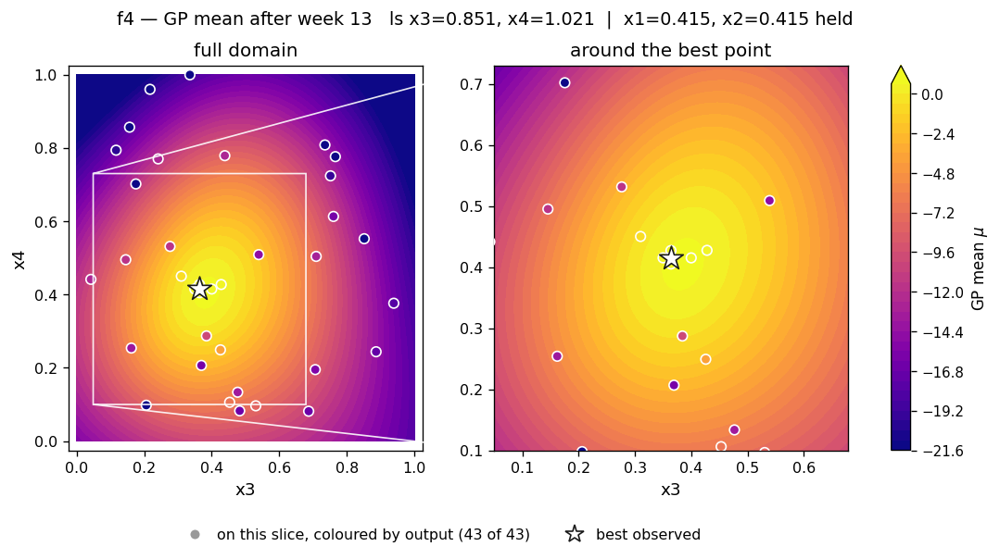
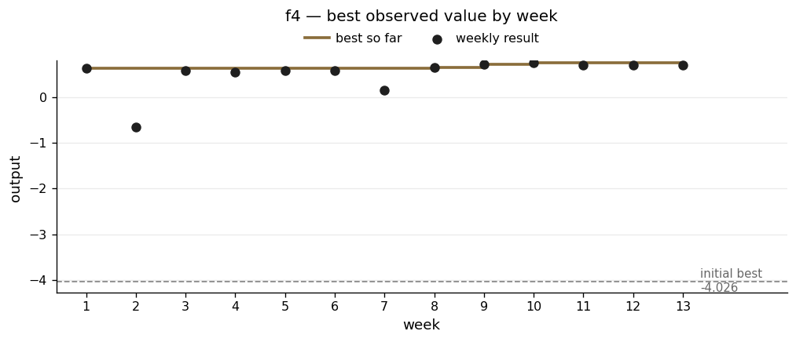

# f4 — where the model was wrong and the raw numbers were right

**The scenario.** Deciding how to place products across warehouses for a business with heavy online sales. The real calculation is expensive and can only be run every two weeks, so an ML model approximates it in hours. Four of that model's settings are being tuned, and the output is how close it gets to the expensive answer. The brief warns the system is dynamic and full of local optima.

| | |
|---|---|
| Dimensions | 4 |
| Initial design | 30 points |
| Weekly submissions | 13 |
| Best value | **0.741945** at (0.415, 0.415, 0.364, 0.415) |
| Best on initial design | −4.025540 |
| Largest gap between prediction and reality | 1.2 × 10⁻² — the worst of the eight |
| Cohort placing | **1st of 34** |

## Why this one mattered

f4 was the function where the model was overridden most often, and it is the one that placed first in the cohort of 34.

Placings were published only after the exercise closed, and the values behind them never were; reading the repositories the cohort published afterwards puts the margin at about 10% over the second-placed entry. Their write-up describes reaching the same conclusion I did: a global model over-smoothing a narrow high-performing region, addressed with a local fit. Spotting the problem was not what separated the results. Acting on it week after week, against a model that kept recommending otherwise, was.

## What the function looks like

f4 has a sharp isolated peak sitting close to the line where x1, x2 and x4 are all about 0.4158, with x3 offset at 0.364.

The defining feature is how abruptly it changes. Week 2's observation of **−0.658** sits within 0.07 of four separate points scoring above **+0.58**:

| compared with | distance | output there | gap |
|---|---|---|---|
| week 5 | 0.055 | +0.583 | 1.24 |
| week 1 | 0.066 | +0.637 | 1.30 |
| week 10 | 0.066 | +0.742 | 1.40 |
| week 9 | 0.066 | +0.710 | 1.37 |

That is the exact situation a smooth model cannot cope with, because it assumes nearby inputs give similar outputs.

The same thing happens inside the good region, where it matters more. Week 7 scored **+0.157** just **0.036** from week 9's **+0.710** — the tightest pair in the dataset, and sitting right beside the eventual answer. The peak is not merely sharp; it is sharp at the scale the final weeks were working at.

Unusually, all four length scales came out at similar values, which makes f4's reading of which dimensions matter the most trustworthy of the eight. What the model could not handle was not *which* dimensions mattered but *how sharply* the surface turned.

## What I did

Early on I followed the model and moved multiple parameters at the same time, my rationale being that the model wasn't optimising parameters in isolation, rather it was finding the joint optimum across all four dimensions at once. However this did not perform as well as I hoped. 

From week 6 I switched to the opposite approach: move one dimension at a time, holding everything else fixed. The reason was attribution. When a joint recommendation changed four things and came back worse, I learned nothing, because I could not tell which change caused it.

The method that worked was a chain per dimension. x1 went:

| x1 | output |
|---|---|
| 0.431 | 0.643 |
| 0.425 | 0.709 |
| **0.415** | **0.742** |
| 0.405 | 0.696 |

Four points, a clean peak in the middle, and a curve fitted through them putting the top at 0.4158.

I did the same for x4, after first resetting x3 to its confirmed value so the two were not tangled together, and for x2, stepping to 0.415 while staying clear of a known bad patch at x2 ≈ 0.44.

**Week 13 found a shortcut.** Two observations that swap x1 and x4 returned *identical* outputs — 0.696302 both, to every digit. f4 is symmetric in those two dimensions. That meant x1's carefully measured peak transferred straight to x4 and closed both dimensions without spending another submission.

## What went wrong

**The model smoothed away the most important thing in the dataset.**

In week 3 I noticed the −0.658 observation was being drawn inside a *warm* region of the predicted surface, which makes no sense. The model was averaging it against the +0.637 point 0.066 away and producing a mildly positive prediction across the whole area. With so few points it simply could not represent structure that sharp.

The conclusion I wrote at the time — *the observations themselves are the primary evidence* — is essentially the method I adopted later. I worked it out in week 3 and then did not apply it for another three weeks.

**The model put x3 in the wrong place for nine weeks.**

Both the GP and a support vector model I fitted separately as a check (R² = 0.9999) said x3's best value was 0.40–0.43. The controlled measurements say otherwise:

| x3 | output |
|---|---|
| 0.350 | 0.583 |
| **0.364** | **0.637** |
| 0.400 | 0.584 |

That is a symmetric peak at 0.364, with equal falls either side. By week 5 the model's own fit quality had improved enough that I could no longer dismiss the disagreement as an optimiser problem. It was the model being unable to represent a peak narrower than its own length scale, so it smoothed across it.

In weeks 12 and 13 I overrode it on x3 twice in a row, even though it claimed a 70–78% chance of improvement at 0.374–0.384. A separate calculation agreed with the raw numbers: moving x3 to 0.400 costs about 0.053. x3 stayed at 0.364 and the best value held.

**Most of what I believed had been measured somewhere else.**

Reviewing this in week 11, I found that only x1 had a proper series of measurements *at the current best point*. x2, x3 and x4 each had exactly one observation there. Everything I thought I knew about those three came from tests run at x1 = 0.431 — a noticeably worse configuration.

That is a subtle way to be wrong. The comparisons were properly controlled when I made them. The reference point had since moved out from under them.

## Result

The slice shows x3 and x4 with x1 and x2 at their best values. The peak reads as a small bright island rather than a broad basin, and the observations, coloured on the same scale as the surface, show how fast the output falls away from it.

The two collapses — week 2 at −0.658 and week 7 at 0.157 — were both useful. The first located the bad patch that constrained every later x2 move; the second showed how little room x2 had. The long shallow climb from week 8 is one-dimension-at-a-time bracketing doing its job.

Week-13 diagnostics — all four runs and the slice grids

| | |
|---|---|
| Acquisition surfaces | [`rbf_ard_ei`](../runs/week_13/surface_f4_rbf_ard_ei_w13.png) · [`matern_ard_ei`](../runs/week_13/surface_f4_matern_ard_ei_w13.png) · [`matern_ard_ucb`](../runs/week_13/surface_f4_matern_ard_ucb_w13.png) · [`rbf_ard_ucb`](../runs/week_13/surface_f4_rbf_ard_ucb_w13.png) |
| Slice grids | [mean](../runs/week_13/slice_f4_mean_w13.png) · [uncertainty](../runs/week_13/slice_f4_sigma_w13.png) |

