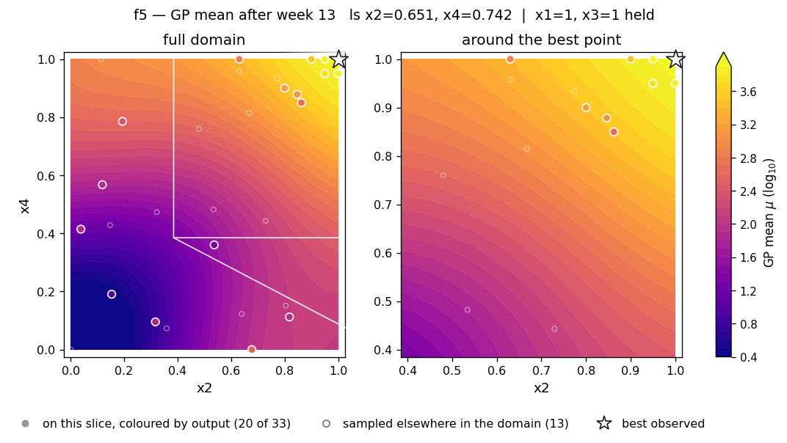
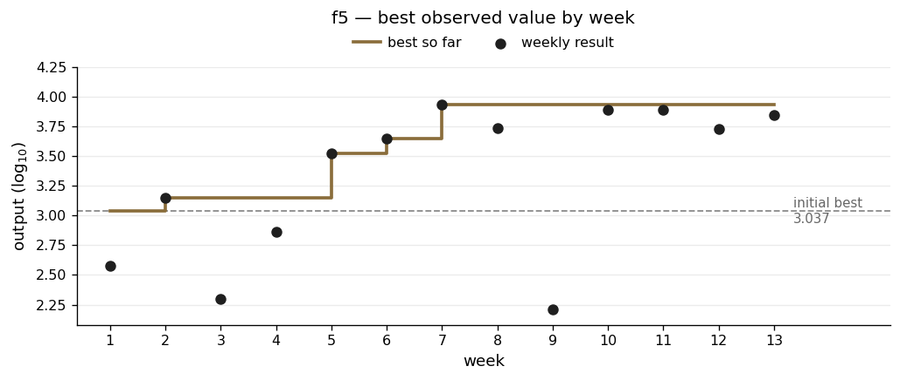

# f5 — a corner that looked settled

**The scenario.** The yield of a chemical process in a factory, controlled by four inputs. The brief describes it as typically unimodal, with a single peak where yield is highest.

| | |
|---|---|
| Dimensions | 4 |
| Initial design | 20 points |
| Weekly submissions | 13 |
| Best value | **8662.41** at (1, 1, 1, 1) |
| Best on initial design | 1088.86 |
| Gain | 8.0× |

## What the function looks like

f5 rises steadily in all four inputs, all the way to the corner of the allowed range. Sweeping each input individually with the other three held at their maximum, all four rose to the boundary without turning over.

That made the corner look like the answer, and the brief's description of a single peak seemed to fit — the peak simply sitting in a corner rather than somewhere inside. The caveat on that reading is set out below.

It also has an exact symmetry. Dropping x2 alone to 0.95 and dropping x4 alone to 0.95 returned **7786.316251** both times, identical to every digit. That is proof of two things at once: the function treats x2 and x4 the same way, and it gives the same answer for the same input.

I also checked whether the inputs act independently. If they did, four separate drops to 0.95 would predict 8662.41 × 0.8989⁴ = 5654.7. The actual all-at-0.95 reading was 5438.9, about 4% lower. So there is mild interaction between them, but they are close to independent.

Outputs span three orders of magnitude and are all positive, so f5 was modelled on log₁₀ with no floor needed.

## What I did

The first six weeks searched. The last six documented.

**Searching.** Rather than just following recommendations, I worked out what was driving each gain. When week 5's push towards the corner produced a new best, I nudged each input individually from the old best towards the new one to see which was responsible. x4 dominated, with a local slope of +2.34 against +1.37 for x2. The next submission pushed x2, x3 and x4 all to the boundary — a move made because I knew *why*, not because a trend suggested it.

Week 7 then took x1 from 0 to 1 while holding the others at the boundary. The output nearly doubled to 8662.41. After that, nothing anywhere in the space was predicted to beat it.

**Documenting.** The remaining weeks ran a deliberate programme: drop one input alone to 0.95, hold the other three at the boundary, and measure what that input is worth on its own. Each submission was chosen for what it would establish rather than what it might win. Week 13's x3 = 0.90 probe went in with a 6.7% chance of beating the best — openly an information choice.

The reasoning behind this still seems right to me as far as it goes. Under best-of-13 scoring the floor is locked once a strong result is banked, so a probe that fails costs nothing but the query, and spending those queries on measurement rather than on re-confirming a known point is the better trade. It produced the symmetry and independence findings above.

What I would change is *what* was measured. Every one of those six probes stayed at or beside the corner. None tested whether the corner was the right place to be.

## What went wrong

**It took 6 weeks to challenge the "Low x1 is better" assumption**

Week 2's notes say *"x1 kept low, consistent with best observations"*, and that was true of the data I had — the two strongest points had x1 = 0.20 and 0.22. Week 4 acted on it, explicitly preferring a recommendation at x1 = 0.0 over one at x1 = 1.0 because low x1 matched the pattern.

Week 7 tested x1 = 1.0 with the other three held at the boundary and got roughly double the previous best. The low-x1 pattern reflected which points happened to have been sampled, not the function.

The lesson is narrower and more useful than "the model was wrong". Nothing was wrong with the model. My mistake was treating a pattern across points that **differed in every input at once** as though it said something about x1 specifically. One controlled test — change x1, change nothing else — settled in a single week what six weeks of pattern-reading had got backwards.

**One exploration bet failed, albeit informatively.**

Week 3 followed a recommendation into a completely different region — low x2, low x3, x4 at the boundary — driven by high uncertainty there. It returned 199 against a then-best of 1404. I recorded it as informative, and week 4 cited it explicitly when returning to the proven region. That is the right use of a failed probe.

**Not utilising full opportunities to explore the surface.**

From week 8 onwards I treated f5 as effectively optimised, on the basis that every dimension had been swept and all rose monotonically to the boundary, so no interior peak existed. But those sweeps were predictions from the fitted model, not queries. Looking at where the 33 observations actually sit, there was a concentration of points towards the corner, with a resulting sparsity of information in the interior.

Given the limited information about the interior, and the rising values at the corners the model reported this as the solution. Moreover having arrived at the corner by Week 8 I spent the remaining queries making minor reductions to each input in turn to identify any local curvature, rather than returning to an exploration strategy of the interior.

## Result

The slice shows x2 and x4 with x1 and x3 held at 1.0. It is a smooth ramp up to the top-right corner with no turning point anywhere. The best point sits on the boundary wall, because that is where the function puts it.

The jump at week 7 is the x1 reversal. Everything after it sits below the best on purpose — each one is a single input dropped to 0.95 or 0.90 to measure what that input contributes. Read another way, the flat line from week 7 onwards is six weeks spent inside one small region of a four-dimensional space.

Week-13 diagnostics — all four runs and the slice grids

| | |
|---|---|
| Acquisition surfaces | [`rbf_ard_ei`](../runs/week_13/surface_f5_rbf_ard_ei_w13.png) · [`matern_ard_ei`](../runs/week_13/surface_f5_matern_ard_ei_w13.png) · [`matern_ard_ucb`](../runs/week_13/surface_f5_matern_ard_ucb_w13.png) · [`rbf_ard_ucb`](../runs/week_13/surface_f5_rbf_ard_ucb_w13.png) |
| Slice grids | [mean](../runs/week_13/slice_f5_mean_w13.png) · [uncertainty](../runs/week_13/slice_f5_sigma_w13.png) |

