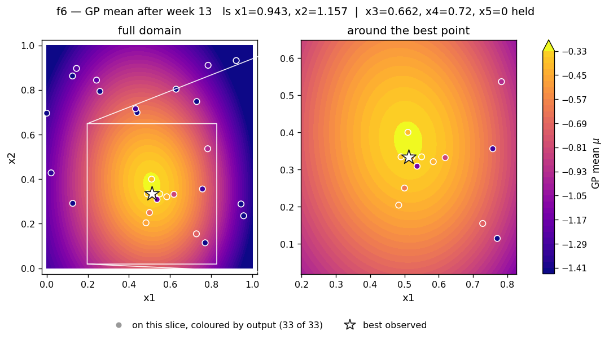
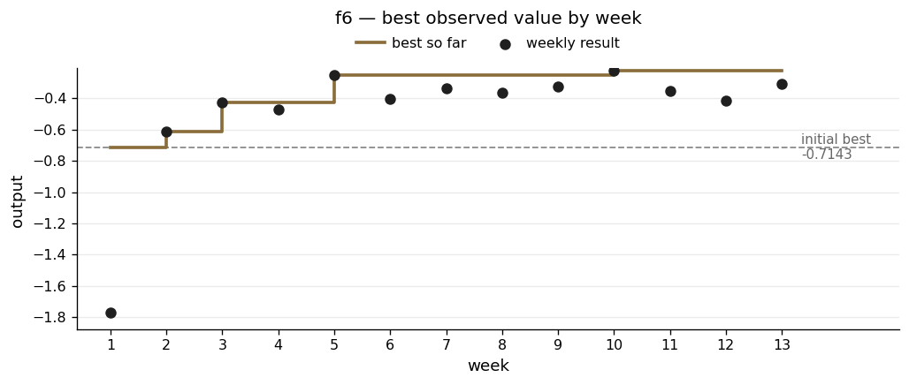

# f6 — the right direction, the wrong step size

**The scenario.** The example scenario given was a cake recipe across five ingredients — flour, sugar, eggs, butter, milk. An expert taster scores each attempt on - the score is negative by design, and the goal is to get it as close to zero as possible.

| | |
|---|---|
| Dimensions | 5 |
| Initial design | 20 points |
| Weekly submissions | 13 |
| Best value | **−0.224110** at (0.512, 0.334, 0.662, 0.720, 0) |
| Best on initial design | −0.714265 |
| Gain | 69% of the way to zero |

## What the function looks like

f6 was the first function in the set with a genuine peak somewhere in the middle rather than at an edge. Four of the five inputs settled on interior values. The fifth, x5, went to exactly 0 early on and never moved — that input is best left at zero.

x1 and x4 turned out to carry the real curvature, and both were properly measured on either side by the end. x3 had a large effect but was never tested on its own at any configuration. x2's length scale sat at the top of its range throughout and no test of it exists anywhere in the 33 observations.

## What I did

f6 gave me the clearest early case *for* trusting the model.

In week 2 I built a proposal by eye from the diagnostic plots — refine near the best point, high x1, low x2, low x5. Then I checked the model's own recommendation surface numerically, and it overturned me. Holding the other inputs near their recommended values, the predicted score peaked at x1 ≈ 0.5 when x4 = 1.0, and actually got *worse* as x1 rose towards 0.73. The apparent preference for high x1 in my best result was specific to the x4 value it came with, not to x1 on its own. The model's point scored 0.49 on expected improvement against 0.03 for my hand-built one, and it produced a gain.

The lesson I wrote down then still holds: **numerical checking catches interactions between inputs that eyeballing fixed slices cannot show.**

It cuts both ways, though. In week 6 I proposed a cautious move and was challenged on the grounds that one panel of the diagnostic grid simply *looked* brighter than another. Checked numerically, the visual reading was right: sweeping across each panel gave a best predicted score of −0.310 at x3 = 0.9 against −0.333 at x3 = 0.7, and a direct sweep peaked at 0.85–0.90 rather than the 0.72 I had proposed.

The middle weeks then bracketed one input at a time. x4 went through 0.739, 0.72 and 0.65 and settled cleanly at 0.72, with the score falling either side. x1 went through 0.55, 0.512 and 0.49 and closed the same way.

## What went wrong

**Inadequate attention to step sizing.**

I accepted a recommendation that moved several inputs at once and roughly doubled the expected improvement, with almost all of the gain coming from pushing x3 from 0.662 down to 0.538. Predicted score: −0.187. Actual: **−0.4167**. Given the scale of this surface this was a very disappointing outcome. 

The model was not wrong about the **direction**. It badly underestimated the impact of the **distance**,which was 0.124, and the nearest supporting observations did not extend anything like that far, so what looked like a prediction was really an extrapolation.

However as a key learning, I took the failed move apart. Using the slopes I had properly measured for x1 and x4, I subtracted their contributions from the total change. What was left implied x3 was worth about +1.438 per unit — which confirmed the model's direction using the data itself rather than the model that had just missed. Week 13 took a 0.020 step the same way instead of the 0.124 that failed, and recovered most of the loss, to −0.306.

**The optimiser drifted in a direction it had no information about.**

In week 12 it also wanted to move x2 from 0.334 to 0.222. I checked: x2's length scale was at the top of its range, a sweep across it was flat to four decimal places, and no test of x2 existed anywhere in the dataset. In this case the optimiser was providing a recommendation about an axis it has no informed opinion about, and I held x2 fixed.

**Inadequate input coverage.** x3 has never been varied on its own at any configuration, and x2 has never been varied at all. This was due to prioritisation of other parameters and the high level of inputs (5), but in hindsight it would have been useful to test these parameters as well. 

## Result

The slice shows x1 and x2 with the other three inputs held at their best values. It is a compact peak in the middle — no edge effects, no ridge, the surface falling away in every direction.

Notice that the coloured observation markers away from the centre disagree with the background underneath them. Those points were taken at very different x3 and x4 values, and the disagreement is the honest signature of looking at a five-input function through a two-input window.

The jagged line is what bracketing looks like. Almost every dip is a deliberate step onto one side of a peak, and the two deepest — weeks 6 and 12 — are the x3 overshoots described above.

Week-13 diagnostics — all four runs and the slice grids

| | |
|---|---|
| Acquisition surfaces | [`rbf_ard_ei`](../runs/week_13/surface_f6_rbf_ard_ei_w13.png) · [`matern_ard_ei`](../runs/week_13/surface_f6_matern_ard_ei_w13.png) · [`matern_ard_ucb`](../runs/week_13/surface_f6_matern_ard_ucb_w13.png) · [`rbf_ard_ucb`](../runs/week_13/surface_f6_rbf_ard_ucb_w13.png) |
| Slice grids | [mean](../runs/week_13/slice_f6_mean_w13.png) · [uncertainty](../runs/week_13/slice_f6_sigma_w13.png) · [other axes](../runs/week_13/slice_f6_secondary_w13.png) |

