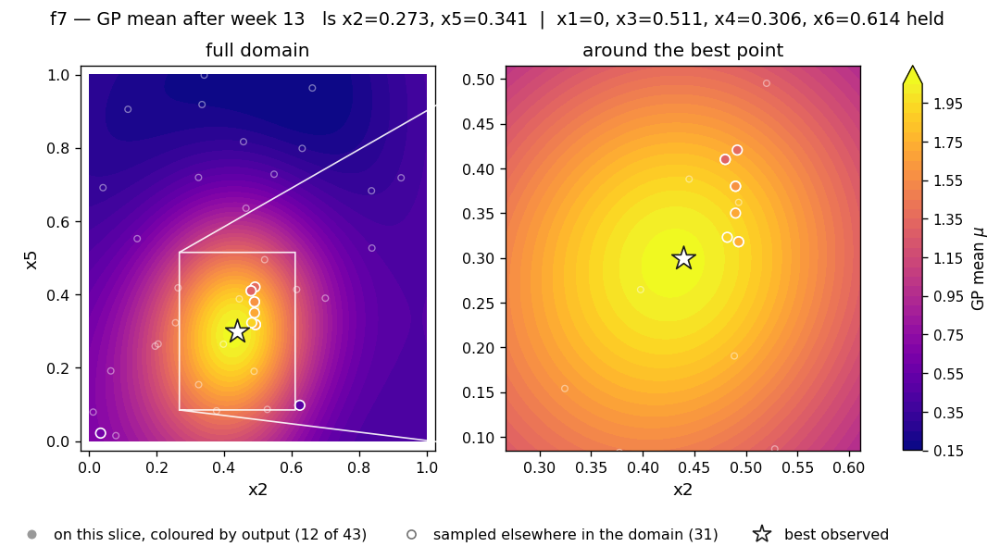
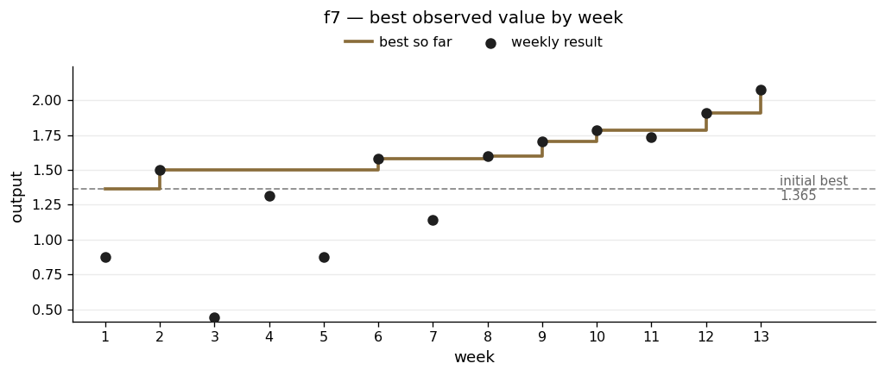

# f7 — the best-behaved function, and the one I trusted too far

**The scenario.** Tuning six hyperparameters of an ML model — learning rate, regularisation strength, number of hidden layers and the like — maximising a performance score such as accuracy or F1.

| | |
|---|---|
| Dimensions | 6 |
| Initial design | 30 points |
| Weekly submissions | 13 |
| Best value | **2.07553** at (0, 0.439, 0.511, 0.306, 0.300, 0.614) |
| Best on initial design | 1.364968 |
| Gain | +52% |
| Largest gap between prediction and reality | 7.9 × 10⁻⁵ — second best of the eight, after f5 |

## What the function looks like

f7 is the function the method was designed for. Comparing all eight, it came first on every measure: the six dimensions have broadly similar curvature, the ratio between the longest and shortest length scale is only 3.7, and the model reproduces its own observations almost exactly. No sign changes, no extreme values, no sharp features it cannot represent.

It is also the only one of the eight where the best result came in the final week. The last two submissions produced the two largest single gains of the entire project, +0.126 and +0.168, both from multi-dimensional moves the model proposed, and both landing above what it predicted.

## What I did

**Early weeks: filled in the map.** Week 2 found that the region where x2 and x3 are both between 0.3 and 0.9 had **no observations at all** across four panels of the diagnostic grid. I spent a submission there, reasoning that if x2 and x3 really were irrelevant the result should land near the other panels, and if not it would show me something new. It produced a new best that held for four weeks.

**Week 3: Set informed expectations for exploration submissions.** The week 3 submission was a pure exploration bet into the empty high-x1, high-x2 corner, with an expected improvement of 0.0009 — effectively zero. The rationale said so in advance: *judge this against the model's prediction of about 1.00, not against the current best of 1.498.* It returned 0.44, below even that modest expectation, which made it a clean negative result on a specific idea rather than an ambiguous disappointment. What it did not settle was either input on its own, since it moved both at once — see below.

**Late weeks: changed approach.** Once every dimension had been measured on both sides and no open questions remained *that I had identified*, single-dimension probes looked to have nothing left to do, and the model's own best-guess point became the right tool. Two of those questions were still open and I had not noticed, which is the subject of the next section. In week 12 its best-guess point and its best-expected-improvement point landed within 0.007 of each other in every dimension. That kind of agreement means the model is confident rather than chasing uncertainty, and the five-dimensional move that followed produced the largest jump of the project.

## What went wrong

**I wrote off x3 as irrelevant for four weeks.**

In weeks 2 and 3 x3's length scale sat at the top of its range, and I correctly identified its recommendations as optimiser noise and overrode them. In week 6, with more data, the length scale dropped to 0.762 — off the ceiling — and a sweep showed a clean peak at x3 ≈ 0.40–0.45. x3 then drove four consecutive gains and became the most productive dimension in the function.

**A local slope pointed the wrong way.**

In week 5 I stopped trusting the unstable global rankings and instead measured how the predicted surface sloped right at the best point — a well-motivated move, since "which way does this slope here" is a far better-posed question than "which dimension matters overall". The sweeps found x4 with a slope of −1.61, an order of magnitude steeper than anything else, and I followed it. It failed: 1.315 against a best of 1.498.

The local slope was itself a product of over-fitting to too few nearby points — the same problem that made f1's model unusable. The reasoning was sound given what I knew, and the failure is what made me sceptical of model-derived slopes generally.

**The model changed its mind about a whole dimension.**

x6's length scale flipped between about 0.12 and the ceiling of 5.0 across consecutive weeks on essentially the same data. That is not the data changing; it is the fitting process landing in a different place depending on where it started. Raising the number of restarts from 10 to 50 in week 5 fixed it for the rest of the project.

**x1 was moved to zero in week 2 and never revisited.**

The seed design's best point has x1 = 0.058. Week 2 moved it to exactly 0.0, and all eleven later submissions kept it there. Every one of the top eight results therefore has x1 = 0, which looks like evidence and is not — it records where I was standing, nothing more.

x1 was tested, once, and the test was a bad one. Week 3 went to x1 = 0.700 and returned 0.441 against a then-best of 1.498. But that submission moved x2 from 0.480 to 0.700 at the same time, so it could not separate the two inputs, and 0.700 is far beyond the range where x1 actually turns over. It answered "is large x1 bad?" — yes — and I took it as an answer to "is x1 = 0 right?", which is a different question.

The model agreed with me throughout, which is why nothing forced the issue. Its x1 length scale was 0.719, the second-longest of the six and nowhere near a bound, so lesson 1 does not apply here. Its predicted x1 profile through the best point slopes *down* the whole way — 2.076 at x1 = 0, 2.002 at 0.10, 1.885 at 0.184 — and its best guess anywhere in the domain was 1.957, below its own best observation. The model was not silent about x1. It had the sign backwards and said so confidently for eleven weeks.

**Post-hoc: the bigger miss was x2.**

This part uses information that was not available while the project was running, and is kept separate for that reason. Cohort results published after the close include further observations of this same function — the shared seed design confirms the instance is identical — and refitting on those together with my 43 points reverses the picture. The pooled model's x1 profile through my best point now rises rather than falls, peaking around x1 ≈ 0.2.

Attributing the gap to the stronger region across all orderings of the six inputs puts roughly three quarters of it on **x2** and about two fifths on x1; the shares overlap because the other four inputs contribute negatively. So x1 cost something real, but x2 cost more.

x2 is the input my own fit rated most sensitive — length scale 0.271, the shortest of the six. I submitted x2 = 0.264 in week 1, then held it between 0.439 and 0.493 for the remaining twelve weeks. Why I had no reason to go back is the part worth recording: every seed point with low x2 also had high x1, between 0.765 and 0.882, and all of them scored near zero. Low x2 looked dead because it had only ever been observed alongside something else that was dead. The confound was built into the starting design rather than into anything I did, and only a controlled probe would have exposed it — lesson 3 in its most expensive form.

## Result

The slice shows x2 and x5 with the other four held at their best values. A single clean peak with smooth oval contours — visibly the most regular of the eight surfaces. The zoom shows the late-campaign probes converging on it.

Only 12 of the 43 observations are close enough to this slice in the other four dimensions to count as evidence about it; the remaining 31 are drawn as faint rings. In six dimensions that is unavoidable, and it is better shown than hidden. The surface is confident because the function is well behaved, not because this particular plane is densely sampled.

The four low points in the first seven weeks are the exploration bets and the failed x4 move. From week 8 the climb is continuous, and the last two weeks are the steepest gains of the project.

Week-13 diagnostics — all four runs and the slice grids

| | |
|---|---|
| Acquisition surfaces | [`rbf_ard_ei`](../runs/week_13/surface_f7_rbf_ard_ei_w13.png) · [`matern_ard_ei`](../runs/week_13/surface_f7_matern_ard_ei_w13.png) · [`matern_ard_ucb`](../runs/week_13/surface_f7_matern_ard_ucb_w13.png) · [`rbf_ard_ucb`](../runs/week_13/surface_f7_rbf_ard_ucb_w13.png) |
| Slice grids | [mean](../runs/week_13/slice_f7_mean_w13.png) · [uncertainty](../runs/week_13/slice_f7_sigma_w13.png) · [other axes](../runs/week_13/slice_f7_secondary_w13.png) |

