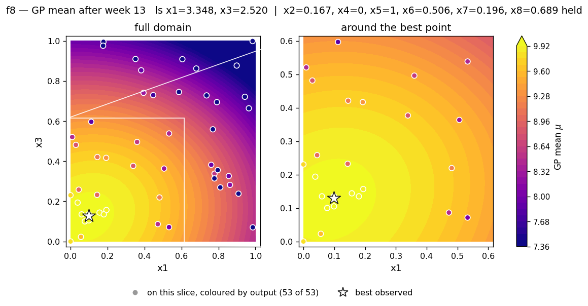
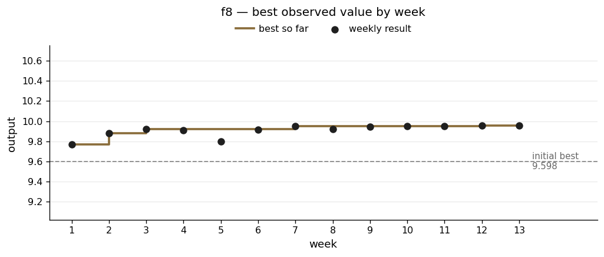

# f8 — eight dimensions, thirteen queries, and a flat top

**The scenario.** Tuning eight hyperparameters of an ML model. The brief's worked example lists learning rate, batch size, number of layers, dropout, regularisation strength, initial weight range, and two settings that are really categories written as numbers — activation function and optimiser type.

| | |
|---|---|
| Dimensions | 8 |
| Initial design | 40 points |
| Weekly submissions | 13 |
| Best value | **9.956340** |
| Best on initial design | 9.598482 |
| Gain | +3.7%, of which only +0.3% came after week 5 |
| Spread of the top five results | 0.007 |

## What the function looks like

f8 was the hardest to make progress on, but not necessarily due to its complexity: it starts close to its best and the area around the best is almost flat.

Forty starting points across eight dimensions is about five per dimension — not enough to reveal much about the structure of the surface. The initial best was already 9.598 against a final 9.956. By week 12 the top four results spanned 0.007, and the model's best guess anywhere in the space offered a further gain of 0.002.

The dimensionality is the binding constraint. Thirteen submissions across eight dimensions is not enough to measure every dimension properly even once. I finished with genuine single-dimension evidence for only **three** of the eight: x1 (+0.082), x6 (+0.066) and x3 (+0.060), all small. x2, x4, x5, x7 and x8 had none at all.

## What I did

Because I could not afford to test each dimension individually, f8 leaned on the model more than any other function — but with a consistent rule for when to override it.

**Relied on evidence over the model where feasible e.g. Week 2.** One run had the better fit statistic but recommended x6 = 0.0, while the diagnostic grid showed my actual best observation sitting at x6 = 0.801, with several other strong results in the 0.7–0.9 range. A competing run recommended x6 = 0.451, much closer to where the evidence was. I took the second one despite its worse fit statistic, on the grounds that direct evidence about a specific dimension beats a small difference in a global measure of fit.

**Used single-input moves to keep results attributable e.g. Week 6.** Local slopes gave +0.44 for x1 and +0.25 for x2, far above anything else, and the obvious move was to push both. Before doing so I checked whether they interfered with each other: x1 alone to 0.20 gave 9.979, x2 alone to 0.30 gave 9.970, both together gave 9.993 — close to the sum, so they act roughly independently, with none of the negative interaction I saw in f4 and f6.

I then made the move deliberately *smaller* than what I had tested, at (0.18, 0.28) rather than (0.20, 0.30), because the model's uncertainty was still climbing at the larger step. It still overshot, but was clearly easier to explain given the prior analysis.

From week 8 I tested one dimension per week where I could, choosing between candidates by how well-supported the claim was rather than how big it was. Week 9 is the clearest case. x6 claimed the larger gain (+0.0126) but at x6 = 0.93, far from any data and in a region the model described very loosely. x3 claimed +0.0075 at a value close to the current one, in the dimension the model pinned down most tightly. I picked x3 as it didn't rely on extrapolation.

## What went wrong

**x8 was never resolved.**

Week 3 captured the problem exactly. x8's length scale sat at the top of its range — nominally meaning the dimension made no difference — while the model simultaneously showed expected improvement five times higher at x8 = 1.0 than at x8 = 0.0. Meanwhile my two best observations both had x8 = 0.0, directly contradicting that preference.

I followed the model and bought the information, which was defensible. The result improved, but for reasons I could not attribute to x8. Ten weeks later its length scale was still at the cap, its value stood at 0.689, and week 13 held it there rather than accept the optimiser's proposed shift — on the reasoning that **movement along a dimension the model knows nothing about is drift, not a recommendation.**

**Two settings were carried untested from week 4 to the end.**

x4 = 0 and x5 = 1 appear in every strong result. But every one of those results is a starting-design point that differs in most other dimensions too, so neither setting was ever isolated. Week 13 considered moving both to 0.5 and rejected it as the model predicted a drop of 0.23 with essentially no chance of improvement. That was the right call based on the evidence the model provided, though its opinion about x5 came from a length scale sitting at the cap.

More generally for these inputs and others like x8 I think a different strategy where the overall budget of 13 submissions was allocated so that more features could have been tested may have paid off. However this may have been at the cost of not optimising some of the features that I did have successes with, so would have required more careful analysis and potentially advanced modelling up front.

**The flat top made targeting improvements more difficult.**

By week 12 f8's expected improvement was an order of magnitude below f6's and f7's — not because the model was uncertain, but because it was confident the surface was flat. The acquisition function was correctly reporting that there was very little to gain anywhere. So I accepted small predicted gains and spent the remaining effort on measurement. Week 12 delivered exactly as forecast, 9.9563 against a predicted 9.9558, for +0.0025.

**Some inputs may have been categorical rather than numerical.**

The brief's worked example lists activation function and optimiser type among the eight hyperparameters, written as numbers. The brief's example is an illustration rather than a specification, but if it was the case that some of these parameters needed to be set to extremes to represent categories, this might be the most plausible explanation for some of the challenges with f8.

## Result

The slice shows x1 and x3 with the other six held at their best values. It is a broad smooth gradient towards the lower-left corner rather than a peak — an accurate picture of a function whose top five results differ by 0.0069.

All 53 observations count as "on this slice" here, because every held dimension has a length scale between 3.4 and 10 on a range of 1, so under the model's own assumptions no held dimension rules anything out. Read that sceptically. It is the same length-scale-at-the-ceiling reasoning this project repeatedly found unreliable, and it applies to the surface itself just as much as to the markers on it.

The vertical scale is the point. Thirteen weeks moved the result by 0.36 on a value near 10, and more than three-quarters of that came in the first two weeks. Everything after week 5 sits inside a band of 0.03.

Week-13 diagnostics — all four runs, length scales and the slice grids

| | |
|---|---|
| Acquisition surfaces | [`rbf_ard_ei`](../runs/week_13/surface_f8_rbf_ard_ei_w13.png) · [`matern_ard_ei`](../runs/week_13/surface_f8_matern_ard_ei_w13.png) · [`matern_ard_ucb`](../runs/week_13/surface_f8_matern_ard_ucb_w13.png) · [`rbf_ard_ucb`](../runs/week_13/surface_f8_rbf_ard_ucb_w13.png) |
| Length scales | [`ard_f8_rbf_ard_ei.png`](../runs/week_13/ard_f8_rbf_ard_ei.png) |
| Slice grids | [mean](../runs/week_13/slice_f8_mean_w13.png) · [uncertainty](../runs/week_13/slice_f8_sigma_w13.png) · [other axes](../runs/week_13/slice_f8_secondary_w13.png) |

