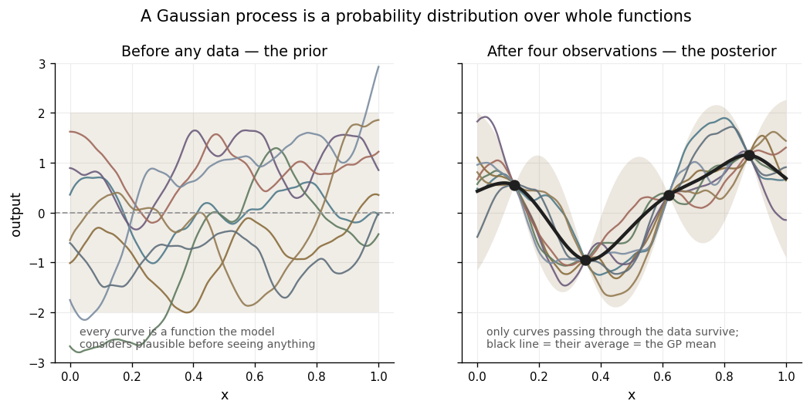
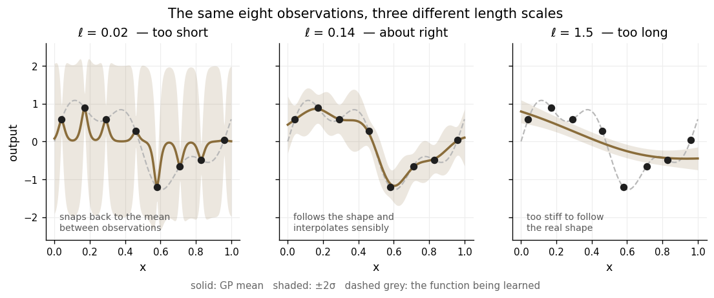
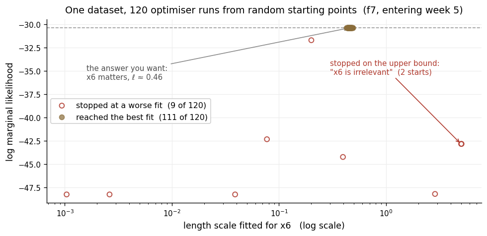

# Model background

This note explains how the surrogate model works, building up from the beginning. It is separate from the [README](README.md) because none of it is specific to this project — it is the background needed to follow the decisions described there.

---

## 1. Gaussian processes

In ordinary regression a prior is placed on *parameters*. Fitting a straight line, the assumption might be that the slope lies somewhere around 2, give or take 1, and the data then updates that belief.

A Gaussian process has no parameters of that kind. The distribution is placed directly on **the function itself** — no slope, no coefficients, no assumed shape. What is being assigned probabilities is the whole curve.

As an example the left panel shows a prior distribution. No data has been observed, yet the model already holds opinions. Each curve is one function drawn at random from it, and the shaded band marks where the function is expected to lie. What they have in common is exactly what is specified by the kernel for the distribution: they vary on a certain horizontal scale, by a certain vertical amount, and with a certain degree of smoothness. Nothing else is assumed.

The right panel shows what happens once data has been observed. Of all the functions in the prior, those consistent with the four observations are kept and the rest discarded. The survivors still vary freely where there is no data and are pinned tightly where there is.

**The predicted surface plotted throughout this project is the average of the surviving functions, and the uncertainty is their spread.** The uncertainty is not added afterwards; it is the disagreement among the functions that remain.

There are two key points relevant to this project:

**The prior includes the hyperparameters.** Choosing a length scale of 0.008 rather than 1.0 is not tuning a fitted model — it is choosing a different set of curves to regard as plausible in the first place.

**Conditioning can only reweight curves the prior already contains.** If the true function has close to no prior probability, it has close to no posterior probability either, however much data is added. This is relevant as it actually occurred for some of the functions e.g. f4

*It should be noted that formally a distribution over functions is infinite-dimensional. However, the whole function does not need to be defined or observed — only its values at the finite set of points under consideration, and at any finite set of points the distribution is an ordinary multivariate Gaussian. This property is part of the definition of a Gaussian process.*

---

## 2. Key model assumptions

The model rests on a small number of assumptions. These are the ones that bear on the decisions in this project; the list is not exhaustive.

**Nearby points have similar outputs.** This is the core idea, and it is what allows any statement at all about a point never evaluated. However applying this in practice depends entirely on what counts as nearby — which is what Section 3 covers.

**The function behaves the same way everywhere (stationarity).** The covariance between two points depends only on the separation between them, not on where in the domain they sit. One set of length scales therefore describes the entire space. This is a key assumption that clearly did not hold across all functions in this project: f1 has a razor-thin channel in one small region and a flat floor everywhere else, and no single description of smoothness fits both.

**The function has a particular degree of smoothness, set by the kernel.** This is a key assumption and not a technicality, because it determines what sharpness the model is capable of representing at all.

| Kernel | Smoothness assumed |
|---|---|
| Matérn, ν = 0.5 | continuous but not differentiable — very rough |
| Matérn, ν = 1.5 | once differentiable |
| **Matérn, ν = 2.5** | **twice differentiable** — the choice used here |
| RBF (squared exponential) | infinitely differentiable |

RBF is the common default and it makes a very strong claim: that the function has no sharp features anywhere, and is so smooth that its behaviour in a small region effectively determines it everywhere. For an unknown black box that is not a safe assumption, and for f1 and f4 it is demonstrably false.

Matérn with ν = 2.5 assumes only that the function has a well-defined curvature — it can be differentiated twice but no further. That permits noticeably sharper local behaviour than RBF while still ruling out genuinely jagged surfaces. It was the primary kernel throughout, with RBF fitted alongside as a contrast. Even so, f4's peak turned sharper than ν = 2.5 could represent.

**Structure is aligned with the input axes.** With one length scale per dimension, the model stretches each axis independently but cannot rotate. A ridge running diagonally across two inputs is harder for it to represent than the same ridge aligned with one axis. f2's ridge happened to be axis-aligned, which helped; f4's peak sits close to the diagonal where x1, x2 and x4 are equal, which did not.

**Observation noise is additive, independent and Gaussian.** For these functions it is close to zero: the same inputs return the same output, confirmed by results in f4 and f5 that returned identical values to every digit.

**The function reverts to a constant mean away from the data.** Far from any observation the prediction returns to the average of what has been seen, with wide uncertainty (effectively scaled by distance to closest observed points). Predictions in unexplored regions are therefore extrapolation and carry little information.

---

## 3. Length scales

The length scale, written ℓ, is a distance: **intuitively how far the inputs must move before the output stops being predictable from where it started.**

The figure below shows the same eight observations fitted three times, with nothing changed but ℓ.

- **ℓ too short (left).** Each observation is treated as an isolated result. The fit reproduces every point and then collapses straight back to the prior mean between them, with the uncertainty band ballooning in each gap. The data has been memorised and nothing has been learned. This is analogous to overfitting.
- **ℓ about right (middle).** Each observation informs its neighbourhood. The fit follows the real shape, and the uncertainty narrows where there is data and widens where there is not.
- **ℓ too long (right).** The function is assumed to vary only slowly, so the fit cannot bend sharply enough to follow the dip. It smooths straight through real structure, and does so confidently; this is analogous to underfitting.

As a real example, this is what occurred in f4, where a Gaussian process and an independently fitted support vector model both smoothed across a peak sharper than their length scales and placed the optimum in the wrong position for nine weeks.

### One length scale per dimension

So far there has been a single ℓ for the whole function. In practice a function may vary rapidly along one input and barely at all along another, so the model is given **a separate length scale for each input dimension**. This is what ARD — automatic relevance determination — means.

The useful consequence follows directly. A very large ℓ in some dimension says the inputs can move a long way along that axis before anything changes, which is another way of saying the dimension barely matters. Relevance is not estimated separately; it falls out of the length scales.

### Three readings of a fitted length scale

All three were used week to week. They are the same number viewed differently.

**As a statement about relevance.** On a domain of width 1, ℓ = 3.5 means the output barely changes across the whole available range of that input. ℓ = 0.05 means it changes fifty times over.

**As a 'wiggle' length.** Functions the model regards as plausible cross their average roughly once every ℓ. f1's fitted ℓ of 0.008 implies about 125 crossings across the unit interval, this oscillatory behaviour partly explains what made f1 so difficult.

**As a ruler for step sizes for investigations.** This was the most common use. A proposed move is read in length scales rather than in raw units:

| Proposed move | ℓ in that dimension | In length scales | What the prediction is worth |
|---|---|---|---|
| 0.02 | 0.008 | 2.5 | Nothing — a leap into unmapped territory |
| 0.02 | 0.10 | 0.2 | Meaningful — an interpolation between known points |
| 0.02 | 1.00 | 0.02 | Little more than a restatement of the nearest observation |

In certain cases, given the limited number of submissions available, investigations used moves larger than the length scale, and these often turned out to be unsuccessful. f6's largest miss was one such case: a move of 0.124 in a dimension where the nearby data did not extend that far.

The maths

Both kernels used here are *stationary* — the covariance between two points depends only on the distance between them. ARD measures that distance in a stretched coordinate system, each axis divided by its own length scale:

$$r^2 \;=\; \sum_{j=1}^{d} \frac{(x_j - x'_j)^2}{\ell_j^2}$$

The kernel then converts distance into covariance:

$$k_{\mathrm{RBF}}(x, x') = \sigma_f^2 \exp\!\left(-\tfrac{1}{2} r^2\right)
\qquad
k_{\nu=5/2}(x, x') = \sigma_f^2 \left(1 + \sqrt{5}\,r + \tfrac{5}{3} r^2\right) e^{-\sqrt{5}\,r}$$

Dividing by $\ell_j$ is literally a stretch: a large $\ell_j$ shrinks that dimension's contribution to $r$, so points far apart along $x_j$ still count as neighbours. In the limit $\ell_j \to \infty$ the term vanishes from $r^2$ altogether and dimension $j$ leaves the model entirely — irrelevance and an infinite length scale are the same statement.

The Matérn family is indexed by $\nu$, which controls differentiability: sample paths are $\lceil \nu \rceil - 1$ times differentiable, so $\nu = 5/2$ gives twice. As $\nu \to \infty$ the Matérn kernel converges to the RBF kernel, which is why RBF corresponds to infinite differentiability.

For a $d$-dimensional function there are $d+2$ hyperparameters in total: the $d$ length scales, an amplitude $\sigma_f^2$ setting the overall vertical scale, and a noise variance $\sigma_n^2$. For f8 that is ten numbers fitted to 53 observations.

---

## 4. Log marginal likelihood

This was a key concept in the optimisation process, which balanced the potential for the distribution to fit all the observed functions e.g. through a very short length scale (overfitting) with the potential for the distribution to be able to predict values away from observed points. The marginal likelihood is a probabilistic metric that rewards explaining the data **without** rewarding flexibility for its own sake.

### Concept

Recapping above, a Gaussian process is a probability distribution over functions defined by length scales, volatility and noise parameters - under a given length scale some shapes are plausible and others are not. For any set of parameters we can ask given these assumptions about the function, how probable was the data that was actually observed?

The marginal likelihood provides a clear metric for this, and hence these hyperparameters are chosen by maximising the marginal likelihood.

### Why over-flexibility is penalised by marginal likelihood

A probability distribution must sum to one. A model that regards a huge variety of datasets as plausible therefore has to spread its probability thinly across all of them, and so assigns only a small amount to the dataset actually observed. A model that regards only a narrow family as plausible concentrates its probability, and scores highly if the data falls inside that family.

So:

- **Length scales too short** — almost anything could happen, probability is spread thin, and the marginal likelihood is low *despite the training data being fitted perfectly*.
- **Length scales too long** — only smooth curves are considered possible, so data with real structure is improbable, and the marginal likelihood is again low.
- **Length scales about right** — high marginal likelihood.

### Limitations

**It compares models on the same data and nothing else.** Matérn against RBF on f4 in week 9 is a fair comparison. f4's −11.24 against f8's +4.20 is meaningless, because the number of observations and the output scale both differ. Every comparison in this repository is within one function in one week.

**A good score does not promise good predictions.** It says the model finds the data it has already seen unsurprising, which is a weaker claim than it sounds. This is why Section 9 exists: the worst errors of this project, f4's x3 and f5's x1, came from models whose fit statistics were perfectly healthy.

The maths

The marginal likelihood integrates the unknown function $f$ out of the picture:

$$p(\mathbf{y} \mid X, \theta) = \int p(\mathbf{y} \mid f)\, p(f \mid X, \theta)\, \mathrm{d}f$$

For a GP with Gaussian noise this integral is closed-form, because $\mathbf{y}$ is then jointly Gaussian with covariance $K_y = K_\theta + \sigma_n^2 I$. Taking logs:

$$\log p(\mathbf{y} \mid X, \theta) = \underbrace{-\tfrac{1}{2}\mathbf{y}^{\top} K_y^{-1} \mathbf{y}}_{\text{data fit}} \;\underbrace{-\;\tfrac{1}{2}\log\lvert K_y \rvert}_{\text{complexity penalty}} \;-\; \tfrac{n}{2}\log 2\pi$$

The first term rewards hyperparameters that explain $\mathbf{y}$. The third is a constant.

The second penalises flexibility by **withholding a reward rather than by subtracting one**. For a correlation matrix with unit diagonal, Hadamard's inequality gives $\lvert K \rvert \le 1$, so $-\tfrac{1}{2}\log\lvert K \rvert \ge 0$ always, and it is *zero* exactly when the observations are uncorrelated. The determinant is a volume: it measures the size of the ellipsoid holding the model's probability cloud. Correlation squashes that cloud flat along the directions the model insists the data must follow, and since total probability is fixed, a smaller volume means a higher density everywhere inside it. That density gain is the reward.

It is collected only if the data lands inside the flattened region. If it does not, the first term is ruinous. Commit hard and be right, and the score is high; commit hard and be wrong, and it is very low; commit to nothing, and it is exactly zero. A short length scale is not the model cheating — it is the model declining to make a claim, and scoring accordingly.

Because the amplitude $\sigma_f^2$ is also free, its optimum is $\sigma_f^2 = \mathbf{y}^\top K_c^{-1} \mathbf{y} / n$ on the correlation matrix $K_c$. Substituting that back makes the first term exactly $-n/2$ regardless of the length scales, and moves the data-fit signal inside a logarithm in the second term:

$$\log p = -\tfrac{n}{2}\log\!\left(\tfrac{1}{n}\mathbf{y}^\top K_c^{-1}\mathbf{y}\right) - \tfrac{1}{2}\log\lvert K_c\rvert - \tfrac{n}{2}\left(1 + \log 2\pi\right)$$

In that form the determinant term rises monotonically with ℓ while the fit term peaks where the assumed smoothness matches the real smoothness. The optimum is the balance between them.

---

## 5. Fitting the hyperparameters: L-BFGS-B

There is now a score to maximise and up to ten hyperparameters to choose. `GaussianProcessRegressor` does this with an optimiser called **L-BFGS-B**. Reading the name backwards:

**BFGS** (Broyden–Fletcher–Goldfarb–Shanno) is a *quasi-Newton* method. Plain gradient ascent knows which direction is uphill but not how far to step, so it zigzags. Newton's method solves that with the matrix of second derivatives — the Hessian — which describes the curvature and therefore the appropriate step length. Computing a full Hessian at every iteration is expensive, so BFGS never computes one. It infers the curvature from the gradients already encountered along the path walked so far, building up an approximation as it goes.

**Limited-memory** means that approximation is never stored. Roughly the last ten step-and-gradient pairs are kept and whatever is needed is reconstructed from those. This is what makes the method practical when there are many parameters.

**-B** is for bounds. Each hyperparameter is confined to an interval, which is how the length-scale bounds in Section 7 are enforced. A run that finishes hard against a bound was stopped *by the box* rather than by finding a peak, which turns out to matter a great deal.

### The limitation that drives the next section

**L-BFGS-B is a local optimiser.** It walks uphill from wherever it starts and halts at the first peak it reaches. It has no mechanism for discovering that a higher peak exists elsewhere. Started in the wrong valley, it converges confidently to the wrong answer.

---

## 6. Multiple restarts

The log marginal likelihood surface has **more than one peak**, and the peaks correspond to genuinely different explanations of the same data. Two recur:

> *This dimension matters, and the observations are somewhat noisy.*
>
> *This dimension is irrelevant, and the observations are clean.*

Both can account for a small dataset, and they sit in different valleys of the likelihood surface. Which one a single run finds depends entirely on where it started.

**A restart is the whole optimisation run again from a different random starting point, keeping whichever run scored highest.** Setting `n_restarts_optimizer = 50` adds fifty runs from points drawn at random within the bounds, on top of the run from the default start. It does not make the search global — nothing does cheaply — but it samples the valleys thoroughly enough that ending in a poor one becomes unlikely.

The figure below measures the problem directly, on f7's data as it stood entering week 5. One dataset, 120 independent single-start optimisations, with the fitted length scale for x6 plotted against the score each run achieved.

Most runs reach the same answer: ℓ ≈ 0.46, x6 a moderately relevant dimension. Nine do not, and two of those stop dead on the upper bound, reporting x6 as irrelevant. Nothing about the data changed. Only the starting point did.

The failed runs are clearly worse *on the score*, sitting twelve to eighteen points below the best. A single run offers no way to see that: without a comparison, a score of −42 is just a number rather than a visible failure. **The restarts are what make the comparison available.**

Fifty rather than five, because the fits compound. Four runs per function, eight functions and thirteen weeks is over four hundred fits, so a one-in-ten failure rate places roughly forty poor fits across the project — landing unpredictably, and occasionally on exactly the dimension a week's decision turned on. The count was raised from 10 to 50 in week 5 and the instability did not recur.

---

## 7. Length-scale bounds

Each length scale is fitted inside a box, $\ell_j \in [\text{lo}, \text{hi}]$. The bounds are set per function and tightened from the default where it produced degenerate fits: f1 takes a lower bound of 0.05 to stop the fit collapsing onto its own observations, and f8 an upper bound of 10 given its eight dimensions.

This leads to the single most consequential point in the whole project.

**If the score keeps improving as ℓ grows, the optimiser walks to the upper bound and stops there.** The value then reported is the bound. It is not an estimate of anything. What it means is:

> At least this large, and the data cannot say more than that.

That is not the same claim as *this dimension does not matter*. One is an absence of evidence, the other is evidence of absence. Treating the first as the second cost four separate multi-week detours, on f2, f3, f7 and f8.

A fitted value sitting exactly on a bound is therefore **a statement about the fit rather than about the function**, and every such value was treated as a question to be answered rather than as an answer.

---

## 8. The noise term

Two different things are called noise in a Gaussian process fit, and they do unrelated jobs.

**The jitter.** A small constant added to the diagonal of the kernel matrix — `alpha` in scikit-learn. As observations cluster, $K$ approaches singularity and the linear solve loses precision, so every GP implementation adds a jitter against that; scikit-learn's own default is $10^{-10}$. This is numerical housekeeping and carries no claim about the data, so it belongs in the kernel whether or not the function is deterministic. On this project it was tightened to $10^{-8}$ from week 12. It was insurance rather than a rescue: at the week-13 length scales the worst-conditioned kernel matrix is f2's, at $3.5 \times 10^{13}$ against a float64 breakdown point nearer $10^{16}$, and the factorisation succeeds on all eight functions without any jitter at all.

**The noise level.** A `WhiteKernel` term $\sigma_n^2$ added to the covariance, whose value is *fitted* alongside the length scales. This is the term that decides whether the model passes exactly through its observations or smooths across them, and it is a claim about the system.

### Why a fitted noise term belongs even on a deterministic function

The natural objection is that these eight functions return the same output for the same input, so the noise should be zero by construction. Determinism was indeed the working assumption throughout — nothing in the brief suggested the service would return different outputs for identical inputs, and no query was ever spent on a deliberate replicate to confirm it, since that would have cost one of thirteen to settle something nothing had put in doubt. The two exact symmetries that surfaced mid-campaign bore it out: f4 returned 0.696302 at two x1/x4-swapped points, f5 returned 7786.316251 at two x2/x4-swapped points.

Two things nevertheless weigh against setting the noise term to zero.

The brief describes f2's output as **noisy**. In context that referred to a rough, locally multi-modal surface rather than a stochastic return, but it is a description of volatility that a noise term is one plausible way to accommodate.

Far more importantly, **the fitted noise term does not represent measurement error at all here.** It absorbs everything the kernel cannot represent. Where the true function carries structure the kernel cannot express — a channel one per cent of the domain wide, smoothness that varies from region to region, a categorical variable encoded as a number — the fitted value is *model discrepancy*, not randomness. It is the only channel through which the model can register that its own assumptions are inadequate. Clamping it to zero does not remove the misfit; it forces the misfit into the length scales instead, which then collapse until each observation explains only itself.

So the term earns its place, and on a deterministic function it earns it for the second reason rather than the first: it is not modelling randomness, it is measuring the kernel's inadequacy. What it requires in return is that its value be read.

### Reading the fitted value

Refitting the week-13 configuration and reporting the fitted noise level:

| | f1 | f2 | f3 | f4 | f5 | f6 | f7 | f8 |
|---|---|---|---|---|---|---|---|---|
| fitted noise | **0.1** | 0.023 | $5.8 \times 10^{-4}$ | $3.9 \times 10^{-5}$ | $10^{-10}$ | $8.4 \times 10^{-3}$ | $10^{-10}$ | $10^{-10}$ |

Only f5, f7 and f8 reach the floor of their allowed range and genuinely interpolate. **f1's value sits on its upper bound** — which, by Section 7, is not an estimate of anything. It is the model stating that it cannot represent that function, and it was stating it in every weekly fit from the start. f1's predicted surface stayed in use until week 4, when it forecast a value fourteen orders of magnitude above anything ever observed. The number that would have explained why was on screen the whole time.

This also corrects a point of record. The intention from week 12 was a near-interpolating fit, on the grounds that the functions are deterministic. What actually changed was the jitter, while the free `WhiteKernel` stayed in the kernel — so no such switch took effect on f1, f2, f3, f4 or f6.

### Fitting twice as a diagnostic

Faced with two nearby points whose outputs differ sharply, the likelihood has two stories available:

> *The function really turns that fast* — which means shortening a length scale.
>
> *The readings are noisy* — which means raising $\sigma_n^2$ and leaving the length scales long.

Both fit the observed data. They are not equally cheap. Shortening a length scale is charged for across the whole domain through the complexity term of Section 4, whereas noise is charged for only at the observations themselves. The cheaper story is usually noise, and the model will tell it even where the function is known to be deterministic, because nothing in the likelihood knows that.

Pinning the noise removes the second option and forces the first. The gap between the two fits therefore measures how much work the noise term was doing:

| | f1 | f2 | f3 | f4 | f5 | f6 | f7 | f8 |
|---|---|---|---|---|---|---|---|---|
| length scales, pinned ÷ free | 1.00 | **0.01** | 0.75 | 0.39 | 1.00 | 0.32 | 1.00 | 1.00 |
| surface divergence | 0.38 | **1.27** | 0.15 | 0.36 | 0.00 | 0.61 | 0.00 | 0.00 |

Divergence is the RMS difference between the two predicted surfaces over 4,096 Sobol points, as a multiple of the output's own standard deviation.

On f5, f7 and f8 it is exactly zero. The free fit drives the noise to its floor unprompted, so pinning it changes nothing — and that zero is the all-clear, which is what makes the test cheap on well-behaved functions.

f2 is the opposite extreme: its length scales collapse to a hundredth of their free values, and the two surfaces differ by more than the entire spread of the data, because the noise term had been absorbing a genuinely sharp ridge. f6 and f4 diverge substantially for the same reason.

f1 is the instructive case. Its length scales do not move at all, because they are already hard against the lower bound of 0.05 imposed to stop the fit collapsing, so the whole divergence comes from the noise term alone. One bound was holding back one failure mode while the noise term quietly enabled the other.

The functions this flags — f1, f2, f4 and f6 — are precisely the four where smoothing across sharp structure caused real errors on this project, and it is silent on the three that behaved. Nothing about it required knowing the answer in advance. It required running the same fit twice and looking at the difference.

---

## 9. Q² and leave-one-out cross-validation

With the hyperparameters fitted, the next question is whether the resulting model is any good. R² would be a typical measure to see how well a model works, but it is not informative here. A Gaussian process whose fitted noise is negligible reproduces its training points exactly, so R² reads 1.000 — the same value for an excellent model and a worthless one alike. That is the case for five of the eight functions here.

### What leave-one-out does

The remedy is to require a prediction the model has not been shown:

1. Take the first observation and hide it.
2. Refit the model on the remaining *n* − 1 observations.
3. Have the refitted model predict at the hidden point's inputs, and compare with the value that was there.
4. Restore it, and repeat for every observation in turn.

One point is left out rather than a larger fold because *n* is small: dropping 20% of 23 observations would change the fitted length scales substantially, and the diagnostic would end up measuring the fold size rather than the model.

That gives *n* predictions, each made by a model that had never seen the point it was predicting. **Q² is the R² formula applied to those predictions rather than to in-sample ones.**

### Reading the number

The baseline for comparison is the error from ignoring the inputs entirely and always predicting the average:

| Q² | Meaning |
|---|---|
| 1.0 | Held-out points predicted perfectly |
| 0.8 | The model genuinely generalises |
| 0.0 | No better than always predicting the mean |
| **below 0** | **Worse than always predicting the mean** — the fit is chasing structure that is not there |

A negative R² on training data is essentially impossible. A negative Q² is entirely possible and is a serious warning. f1's final Q² was −0.25.

The useful quantity is the **gap** between the two. R² = 1.000 with Q² = 0.90 describes a model that has learned the shape. R² = 1.000 with Q² = 0.20 describes a model that has memorised its points and cannot interpolate between them.

### Limitations

**It is slow, deliberately.** The notebook refits the hyperparameters inside every fold, costing *n* × (restarts + 1) full optimisations per function. A much cheaper shortcut exists: with hyperparameters held fixed, the leave-one-out predictions follow in closed form from the matrix inverse already computed. But that shortcut allows each fold to use hyperparameters fitted with the very point it is supposed to be predicting, which is exactly the leakage the diagnostic exists to detect. The notebook therefore sets `Q2_RESTARTS = 2` so that it runs end to end in reasonable time; this is a demonstration setting, commented as such, and the weekly runs used 50.

**Q² is optimistic here due to the specific application.** The observations were chosen iteratively, so many sit deliberately close to their neighbours. Leaving one out removes a point whose neighbours were selected *because of* it, and the model predicts it more easily than it would predict a genuinely new point somewhere unexplored. [`datasheet.md`](datasheet.md) sets this out more fully.

---

## Where this is used

The settings actually chosen, and the weekly model-selection process, are in the [README](README.md#hyperparameter-optimisation). The per-function consequences — where the model was trusted, where it was overridden, and why — are in [`docs/`](docs/).
