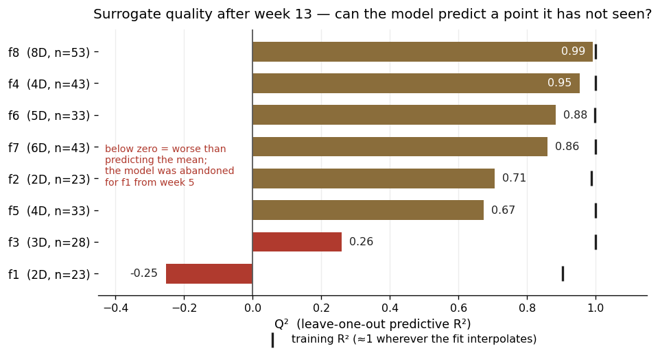

# Model Card

The model here is a **surrogate**: a Gaussian process fitted to the observations collected so far, whose job is to propose where to query a hidden function next. It is refitted from scratch each week, and there are eight of them — one per function, f1 to f8 — sharing the same design but with their own data, dimensionality and fitted parameters.

## Model Description

**Input.** A point in the unit hypercube, [0, 1]ᵈ, where d is between 2 and 8 depending on the function. Inputs arrived already normalised, so no rescaling was applied. Nothing else is supplied — no gradients, no functional form, no category labels.

**Output.** Two numbers at any point the model is asked about:

- **μ**, the predicted value of the hidden function there;
- **σ**, the model's own uncertainty about that prediction.

Both are needed. An acquisition function combines them into a score for how worthwhile a point would be to query — expected improvement (EI) as the primary, upper confidence bound (UCB) as a contrast — and the highest-scoring candidate becomes that week's submission.

For f1 and f5 the model is fitted to log₁₀ of the output rather than the raw value, because their outputs span roughly 140 and 5 orders of magnitude. f1 additionally floors its negative outputs at −300 in log space, so that a large-magnitude negative result cannot masquerade as a strong one during maximisation.

**Model architecture.** A Gaussian process regressor (`sklearn.gaussian_process.GaussianProcessRegressor`) with:

| | |
|---|---|
| Kernel | Constant × Matérn (ν = 2.5) with ARD, plus a white-noise term. An RBF variant was fitted alongside every week as a cross-check |
| Length scales | One per input dimension (ARD), so the model learns which dimensions matter rather than being told |
| Hyperparameters | Amplitude, the d length scales and the noise level, fitted by maximising the log marginal likelihood via L-BFGS-B with 50 random restarts |
| Noise | A fixed 1 × 10⁻⁸ jitter on the covariance diagonal, plus a freely fitted `WhiteKernel`. The free term absorbs structure the kernel cannot represent, so its fitted value reports on the model's own adequacy: f5, f7 and f8 drive it to the floor and interpolate, while f1 drives it to its ceiling. See the README |
| Candidate generation | A scrambled Sobol screen over the domain (5,000–20,000 points by dimension), scored by the acquisition function, then L-BFGS-B refinement from the ten best |

Matérn 2.5 is the primary choice because RBF assumes the function is infinitely smooth, which is a strong claim about an unknown box and a poor one for f1 and f4. Running both every week made their disagreement informative in itself: where the two kernels persistently differed, it usually meant the data did not constrain the fit.

## Performance

The surrogate has two jobs, and they are measured differently.

**As a predictor,** the relevant question is whether it can predict a point it has not seen. Training R² cannot answer this. Wherever the fit interpolates it reproduces its own observations exactly, so R² reads 1.000 whether the model is good or useless — which is the case for f3, f4, f5, f7 and f8. The three exceptions are informative in their own right: f1 (0.903), f2 (0.987) and f6 (0.997) fall short of 1.000 because their fitted noise term is large, so the model is not interpolating. The better measure is **Q²**, the same statistic computed by leave-one-out cross-validation: remove an observation, refit, predict it, repeat.

| | dims | n | R² | Q² |
|---|---|---|---|---|
| f1 | 2 | 23 | 0.903 | **−0.25** |
| f3 | 3 | 28 | 1.000 | 0.26 |
| f5 | 4 | 33 | 1.000 | 0.67 |
| f2 | 2 | 23 | 0.987 | 0.71 |
| f7 | 6 | 43 | 1.000 | 0.86 |
| f6 | 5 | 33 | 0.997 | 0.88 |
| f4 | 4 | 43 | 1.000 | 0.95 |
| f8 | 8 | 53 | 1.000 | 0.99 |

Five of the eight predict held-out points well. The two failures are the important entries:

- **f1's Q² is negative** — the model predicts unseen points *worse than simply guessing the average*. - this means that the surrogate was worthless for f1. It matches what was observed at the time, when one fit predicted a value of 10¹⁴ for a function whose best observation was 10⁻¹⁵, and it justifies the decision taken in week 5 to stop using the model for f1 entirely and step empirically instead.
- **f3's Q² of 0.26** is weak, reflecting a dimension (x1) that had no controlled test anywhere in the dataset for eleven weeks, leaving its length scale unconstrained.

The gap between the R² and Q² columns is the point of the table. R² says all eight models are perfect. Q² says one is worse than useless.

**As a decision aid,** the relevant question is whether following it produced good queries. All eight functions improved on their initial designs:

| | improvement over the initial design |
|---|---|
| f1 | +10.4 orders of magnitude |
| f2 | +7.7% |
| f3 | 98% of the gap to zero closed |
| f4 | negative → positive (−4.03 → +0.74) |
| f5 | 8.0× |
| f6 | 69% of the gap to zero closed |
| f7 | +52% |
| f8 | +3.7% |

These two measures do not agree, and that is worth stating plainly. f1 has the worst surrogate of the eight and the largest improvement, because the surrogate was eventually ignored and the surface had huge orders of scale, even after taking logs into account. f8 has the best surrogate but the smallest improvement, because its function is genuinely flat near the optimum. **Surrogate quality and optimisation success are not the same thing.**

## Limitations

**It assumes the function behaves the same way everywhere.** A single set of length scales is fitted for the whole domain — the stationarity assumption. Several of these functions violate it badly. f1 has a razor-thin channel in one small region and a flat floor everywhere else; no single smoothness setting describes both.

**It cannot represent features sharper than its own length scale.** Where the true function turns more abruptly than the fitted smoothness allows, the model smooths across the feature and places the optimum in the wrong spot — confidently. f4 is the clear example: both the GP and an independently fitted SVR put its x3 optimum at 0.40–0.43 for nine weeks, while a controlled three-point test showed a symmetric peak at 0.364.

**A length scale at its bound is not an estimate.** When the fit is unconstrained in some direction, the optimiser walks the length scale to the edge of its allowed range and stops. This does not mean that this dimension is irrelevant, rather that there isn't evidence of its relevance. Recognising this and interrogating further would have saved multiple weeks on f2, f3, f7 and f8.

**Very little data for the dimensionality.** f8 has 53 observations across 8 dimensions. Any claim about its structure is weakly supported, and it finished with genuine single-dimension evidence for only three of its eight inputs.

**Not a global model.** These surrogates were built to guide the next query, not to describe the functions as a whole. Predictions far from sampled regions are extrapolation and should not be trusted.

## Trade-offs

**Interpolating versus smoothing.** Forcing the model to pass exactly through every observation is right when the data is dense and the function is deterministic, and wrong when it is not — with nothing available to absorb structure it cannot represent, the fit shortens every length scale until each observation explains only itself. Refitting the whole project both ways shows the cost: f2, f4 and f6 all fit materially worse with noise pinned to zero, while f5, f7 and f8 are indifferent. The switch made in week 12 was right *for week 12*, when sampling had become dense; it would have been misleading in week 2. In the event the switch was only partly applied — the free noise term was never removed from the kernel, so f1, f2 and f6 continued to smooth. The README records this.

**Exploration versus exploitation, and the acquisition functions' blind spot.** Both EI and UCB reward uncertainty, and in an unexplored region uncertainty is driven by distance from existing data rather than by anything about the function. A candidate can therefore score highly purely for being far from everything. This happened twice and was caught by plotting the mean surface before submitting — in f2 a high-σ candidate sat on the declining flank of the ridge with μ = 0.290 and EI = 0.000, and in f7 a UCB run wanted a boundary value for the same reason.

**Where the model can be trusted.** It is most reliable on smooth, well-sampled, moderately-sized problems: f7, its best-behaved function, gave the two largest gains of the project from multi-dimensional moves the model proposed. It is least reliable in more complex cases — near sharp optima, on sparse data, and in dimensions with no controlled evidence. The working rule that emerged was to follow the model where its own diagnostic metrics were good and its recommendations agreed across kernels, and to prefer direct approaches where they were not.

**Restarts cost time and buy stability.** Fifty restarts per fit is roughly five times the default cost. It buys protection against the optimiser settling in a poor local mode of the likelihood — which, before the change, made f7's x6 length scale flip between 0.12 and its upper bound across consecutive weeks on nearly identical data.

---

*Fuller detail on every point here is in the [README](README.md); per-function accounts are in [`docs/`](docs/).*
